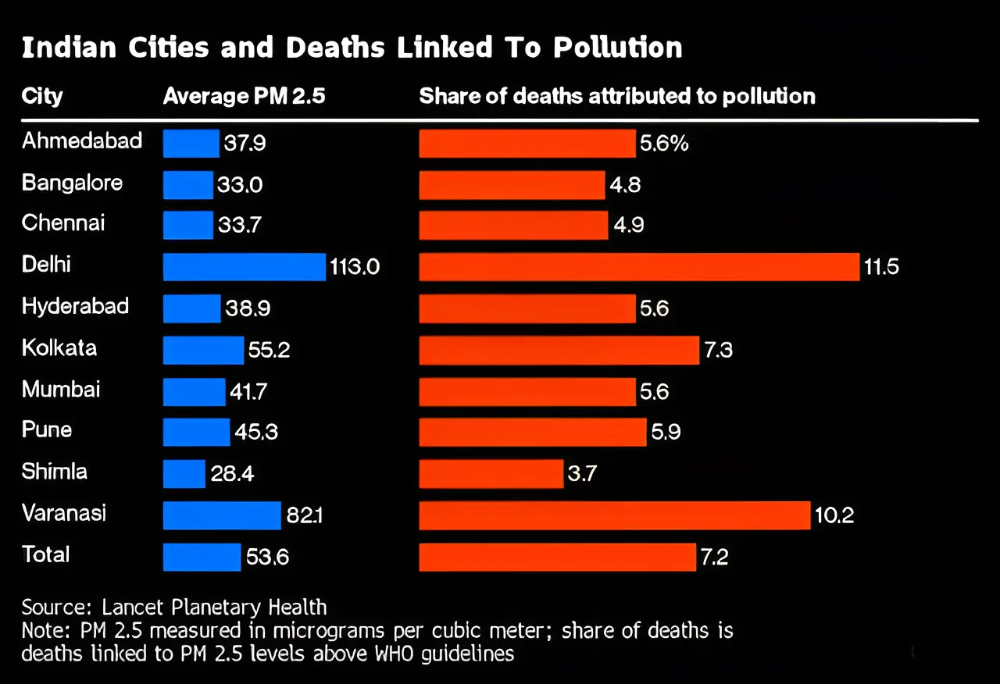

# Pollution as a cause of death on death certificates?

[Ella Adoo-Kissi-Debrah](https://www.ellaroberta.org/) was a nine-year-old girl who died from air pollution in London in 2013. But it took seven years of legal struggle by her mother to get ["air pollution" documented as a cause of death on her death certificate](https://www.theguardian.com/environment/2020/dec/16/girls-death-contributed-to-by-air-pollution-coroner-rules-in-landmark-case). Her story took me down a rabbit hole of death certificates, mortality statistics, and how they can influence public health policies.

Several statistical studies have attributed a large number of deaths to air pollution. One such study reported that [7.2% of all daily deaths across ten Indian cities were attributable to PM2.5 concentrations exceeding WHO guidelines.](https://www.thelancet.com/journals/lanplh/article/PIIS2542-5196%2824%2900114-1/fulltext). Also see: [Deaths from Ambient Air Pollution.](https://lancetcountdown.org/air-pollution-and-health/)

Different methods produce different estimates, but none of them seem to be enough to make the government acknowledge that air pollution is fatal. In 2025, the government stated in Parliament that ["There is no conclusive data available to establish a direct correlation of death/disease exclusively due to air pollution."](https://sansad.in/getFile/annex/253/AU1477.pdf?source=pqars)

That made me wonder: Will the government acknowledge that air pollution is fatal if we have at least one death certificate documenting air pollution as a cause of death? And could such documentation influence policy changes? I think (subject to correction) this is not impossible or illegal. Our medical officers can document pollution as a contributory factor. 
 
I read about examples of [how documenting causes of death contributed to policy changes](https://publichealthpost.org/health-equity/saving-lives-begins-with-death-certificates/), from [cholera](https://www.comfsm.fm/socscie/histchol.htm) to coal workers' pneumoconiosis (CWP), also known as black lung disease. Death certificates played a role in bringing attention to these public health issues.

If this is the kind of data governments are willing to listen to, maybe that's where we should start making noise.